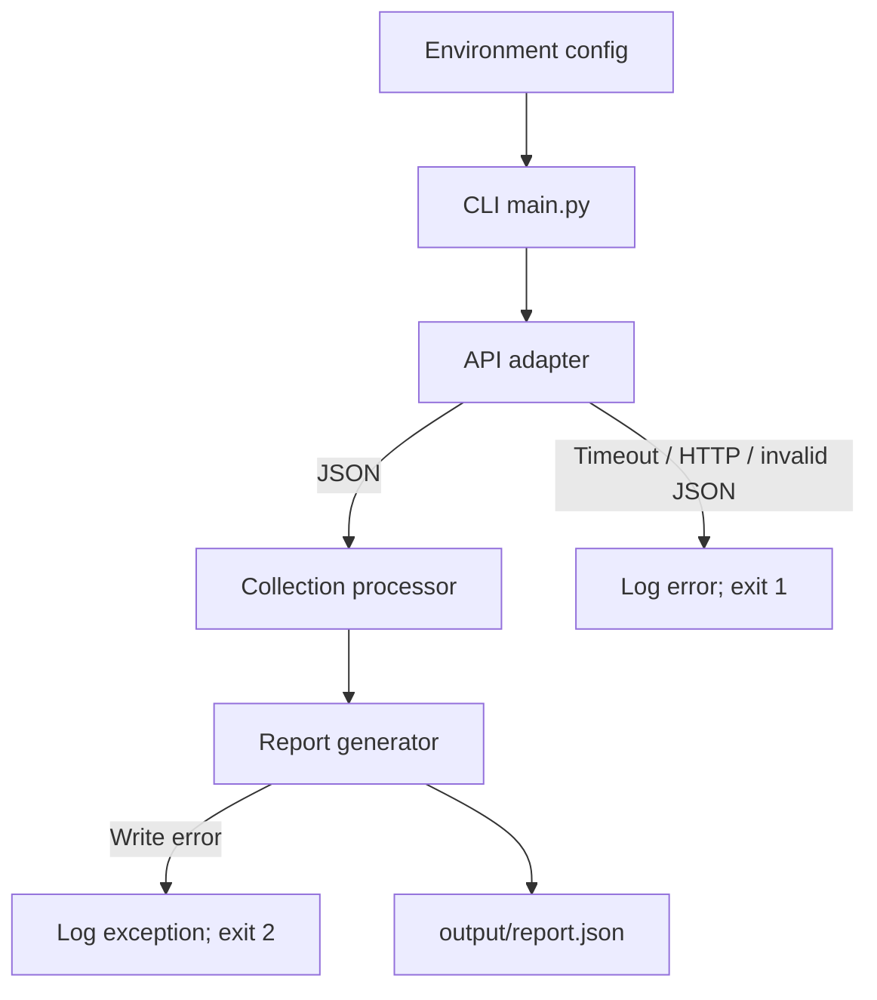

# Architecture

```mermaid
flowchart TD
  A[Environment config] --> B[CLI main.py]
  B --> C[API adapter]
  C -->|JSON| D[Collection processor]
  C -->|Timeout / HTTP / invalid JSON| E[Log error; exit 1]
  D --> F[Report generator]
  F -->|Write error| G[Log exception; exit 2]
  F --> H[output/report.json]
```

Input contract: JSON list of records with `id`, `name`, `email`.
Output contract: `generated_at_utc`, `summary`, `records`, `rejected_records`.
